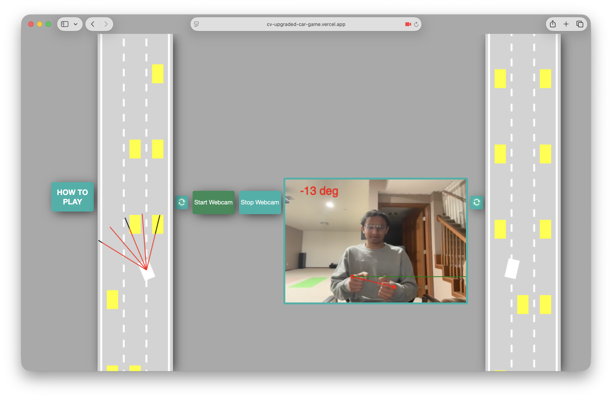

# Computer Vision-Upgraded Self-Driving Car Game

This project builds upon my earlier self-driving car game with a computer vision upgrade enabling players to steer their car by tilting their fists, as if they're turning a steering wheel.

You can check out the project [here](https://cv-upgraded-car-game.vercel.app)! Safari is recommended, Google Chrome can cause issues if many tabs are open.

Key Learnings:

- Hand tracking and landmark extraction (using MediaPipe Hands)
- Scale-invariant prediction and coordinate normalization
- Real-time video processing

# Usage

Check it out [here](https://cv-upgraded-car-game.vercel.app)! Safari is recommended, Google Chrome can cause issues if many tabs are open. Or, download the code and open index.html!
