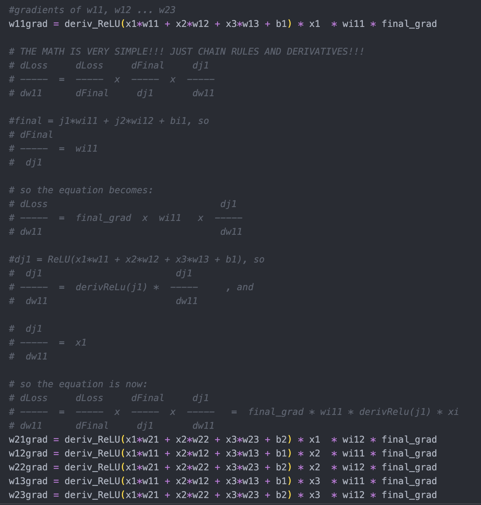

# Neural Network From Scratch
This project implements a simple neural network from scratch to practice the mathematics behind backpropogation and gradient descent. 



I first wrote **`net.py`** using all global variables to prevent any confusion arising from matrix multiplication or dimensions, and later made **`net_vectorized.py`** to clean up the code and become more comfortable with using matrices. Both scripts achieve a simple regression task of mapping the given 3 inputs to the output 4, meaningless except for learning purposes. 

Originally written 08/2024 (summer after high school) as the first ML-related code I ever wrote. Uploaded 11/2025. 

Key Learnings:
- ReLU activation function
- Backpropagation mathematics (via writing out chain rule calculations and matrix dimensions)
- Gradient descent 

# Usage

```bash
python net.py
python net_vectorized.py
```

